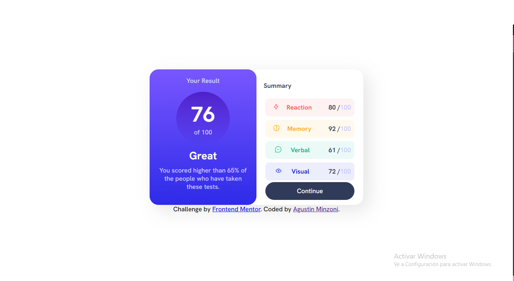

# Frontend Mentor - Results summary component solution

This is a solution to the [Results summary component challenge on Frontend Mentor](https://www.frontendmentor.io/challenges/results-summary-component-CE_K6s0maV). Frontend Mentor challenges help you improve your coding skills by building realistic projects. 

## Overview

### Screenshot

### Links

- Solution URL: [Add solution URL here](https://your-solution-url.com)
- Live Site URL: [https://tecnozoni.github.io/Result-summary-component/]

## My process

### Built with

- HTML5
- CSS 
- Flexbox
- Mobile-first workflow

### What I learned

I keep practicing Flexbox and the truth is that the layout of this project was a bit complicated but I will keep practicing to learn even more styles. 

### Continued development

I have tested my knowledge of Flexbox and have improved my way of using it, however it is something that along with Grid I need to continue to improve.

## Author

- GitHub - [TecnoZoni](https://github.com/TecnoZoni)
- Frontend Mentor - [@TecnoZoni](https://www.frontendmentor.io/profile/TecnoZoni)
